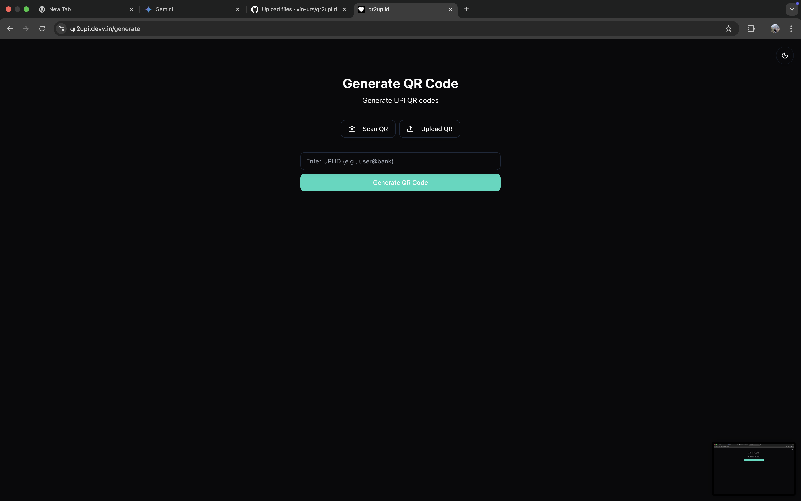
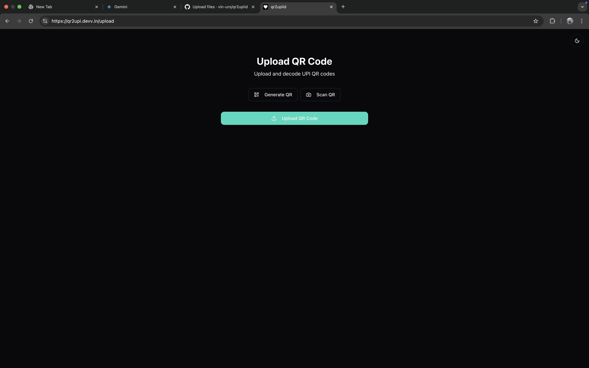

# qr2upiid

# UPI QR Code Generator & Scanner

This web application allows you to:

* **Generate QR codes** for UPI IDs, making it easy to receive payments.
* **Upload QR code images** to decode the UPI ID or other information.
* **Scan QR codes directly** from your webcam.

The app features a minimal design with day/night themes for optimal user experience.






## Features

* Generate QR codes for any valid UPI ID.
* Download generated QR codes as PNG images.
* Upload and decode QR code images.
* Scan QR codes using your webcam.
* Day/night theme toggle for comfortable use in different environments.
* Minimal and modern design.
* Responsive layout for various screen sizes.

## Technologies Used

* HTML5
* CSS3
* TypeScript
* React
* `qrcode.js` (for QR code generation)
* `jsQR` (for QR code decoding/scanning)
* Tailwind CSS (for styling)
* Radix UI (for UI components)

## Getting Started

To get a local copy up and running, follow these steps:

### Prerequisites

Make sure you have Node.js and npm installed on your machine.

### Installation

1. Clone the repository:
    ```sh
    git clone https://github.com/vin-urs/qr2upi.git
    ```
2. Navigate to the project directory:
    ```sh
    cd qr2upiid
    ```
3. Install the dependencies:
    ```sh
    npm install
    ```

### Running the Application

1. Start the development server:
    ```sh
    npm run dev
    ```
2. Open your browser and navigate to `http://localhost:3000`.

### Building for Production

To create a production build, run:
```sh
npm run build
```

## Contact

Reach out to me at:
Vinayak Singh  - singhvinayakurs@gmail.com